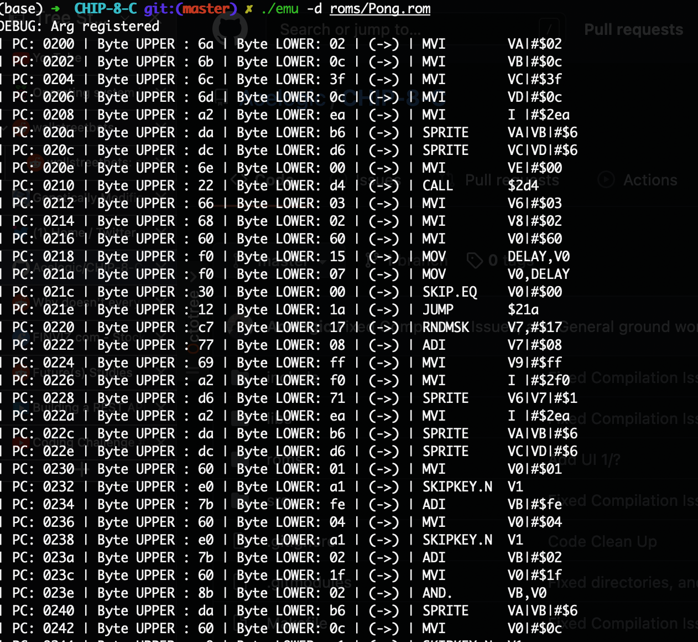

# CHIP-8-C

This is a chip-8 emulator that implements most of the functionality from the original chip-8 interpreter. GUI frontend and Controllers still needs to get implemented. 

Roms to test with are included in the roms folder 

## Usage
```
"Usage: emu -d <filename> | emu -f <filename>\n");
```
### Disassembler implemented with -d 


